---

<b>Custom Cameras Add-on</b>, a powerful and highly customizable add-on for Minecraft Bedrock Edition. Whether you're crafting cinematic scenes building security systems, or just exploring your world from unique angles, this addon gives you full control over the camera like never before.

Create dynamic tracking cams, static cinematic shots, or anything in between.
Every camera is fully
customizable—position, rotation, type, behavior—and all data is saved permanently. No command block chaos, no
limitations—just pure visual freedom.

The best way to understand the power of this addon? Yeah by trying it out!!

---

## ⬇️ 1.0.0 Changelog
- First Version.

---

## ✅ Installation

1. [Download](https://darkblockgaming.github.io/addons/custom-cameras/) the latest **Custom Cameras `.mcpack`** file.
2. Open the file with **Minecraft Bedrock Edition** to install the add-on.
3. In your world settings, enable **Experimental Features**, including:
   - **Beta APIs**
4. Make sure the **Behavior Pack** is applied to your world.

---

## 📚 Custom Cameras Add-on Documentation

After installing and activating the **Custom Cameras** add-on you must type **`?cc`** in the chat. This step is very important and this will give you the tools or items needed to use and customise the add-on.

After this you will get an stick that you can use to open and navigate through different menus of this add-on, you will be able to create different cameras, name them, use them, customise them, and much more!!

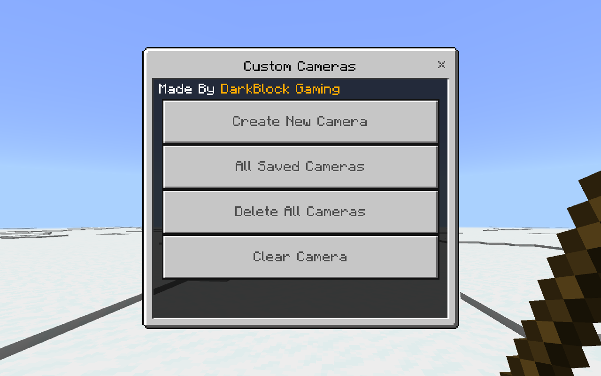
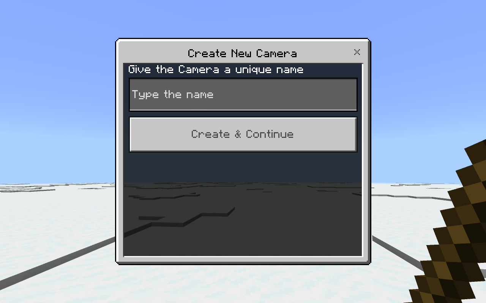
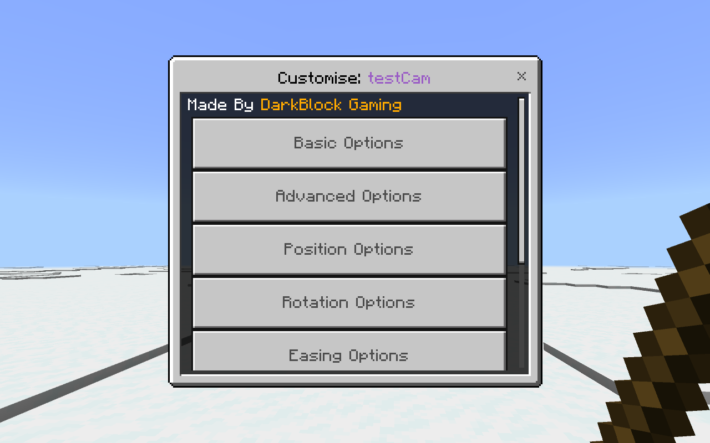
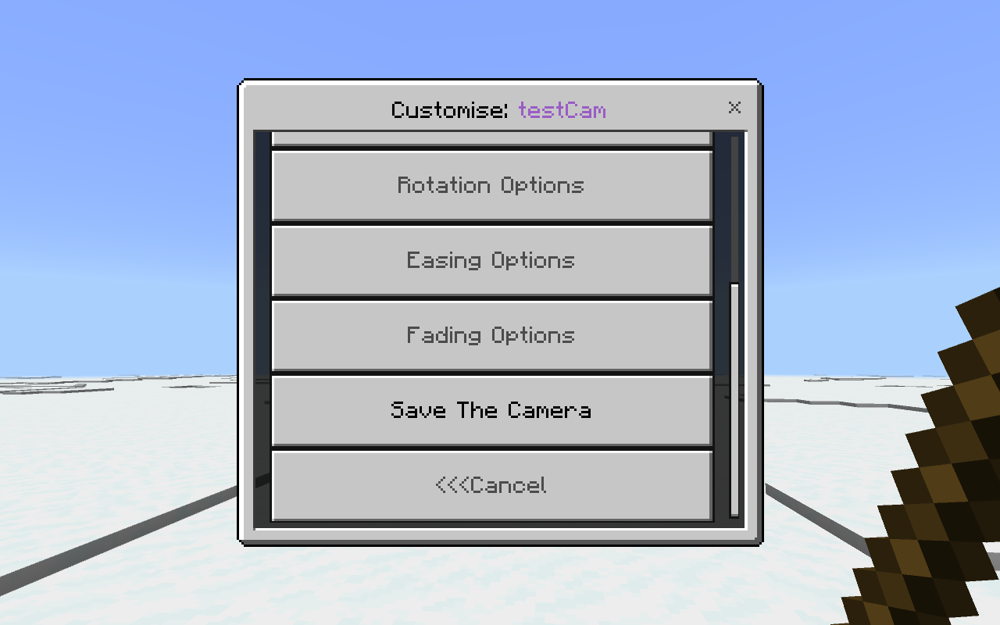
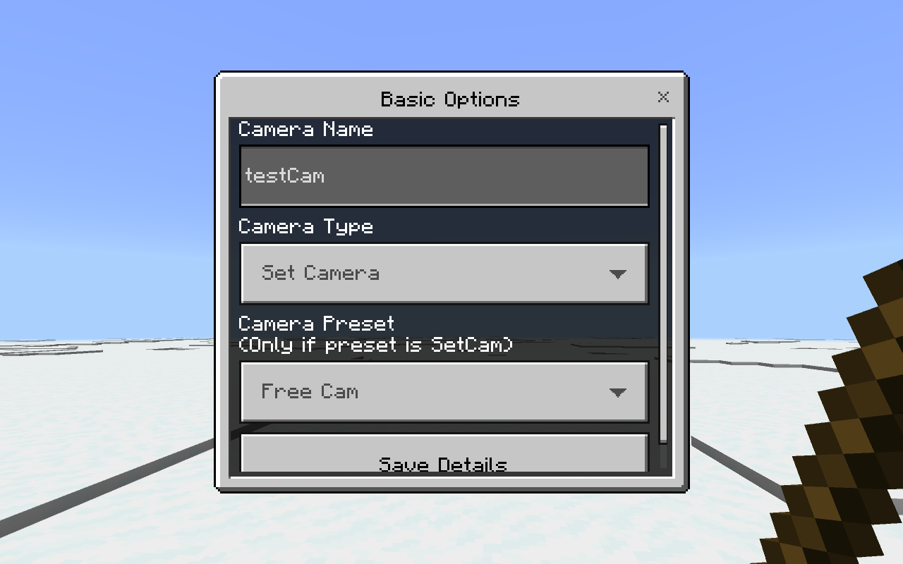
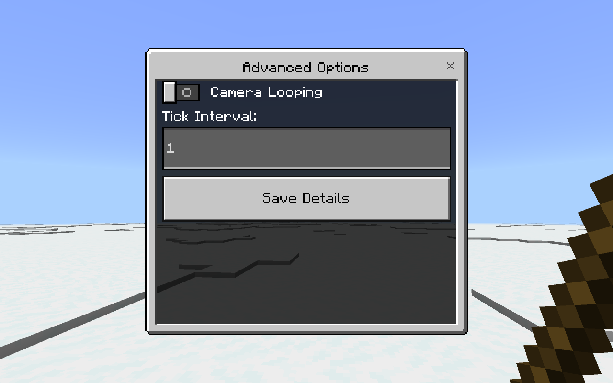
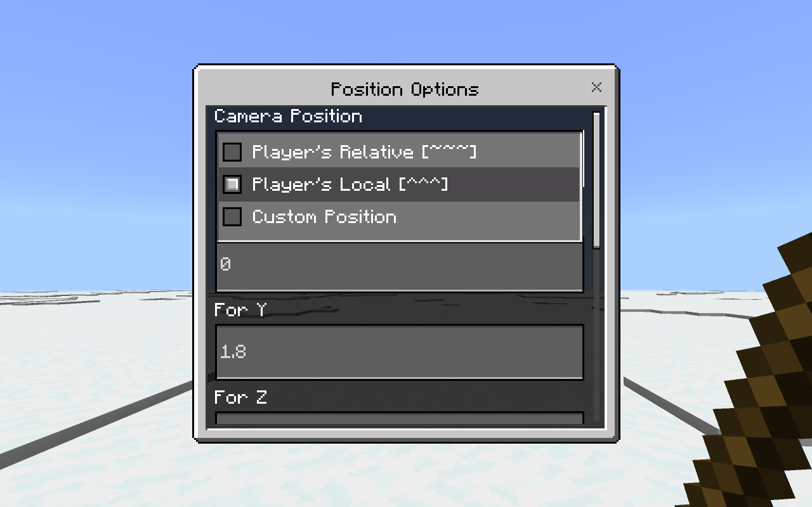
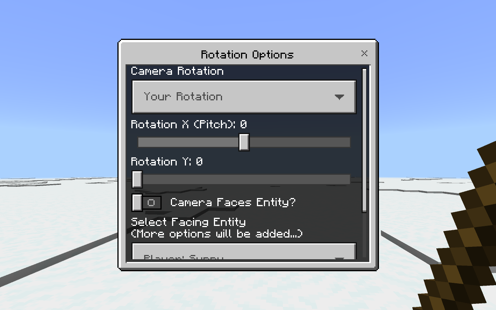
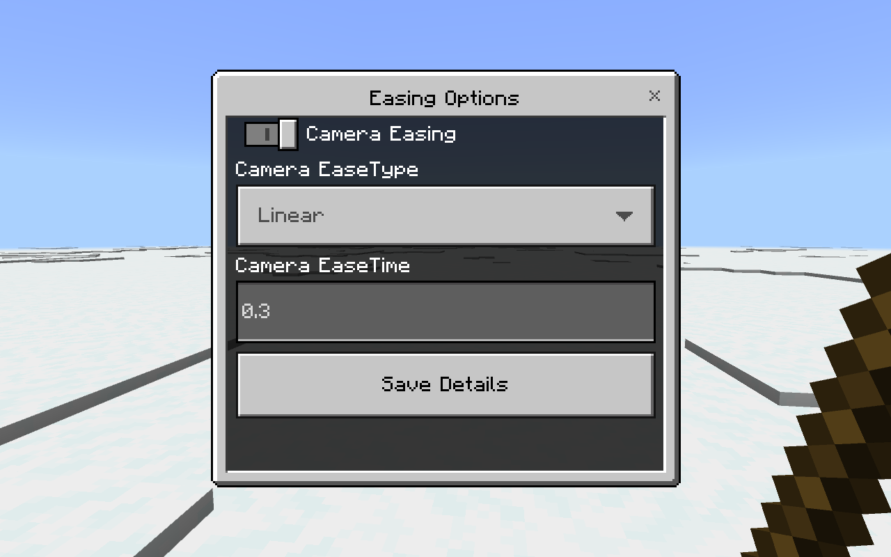
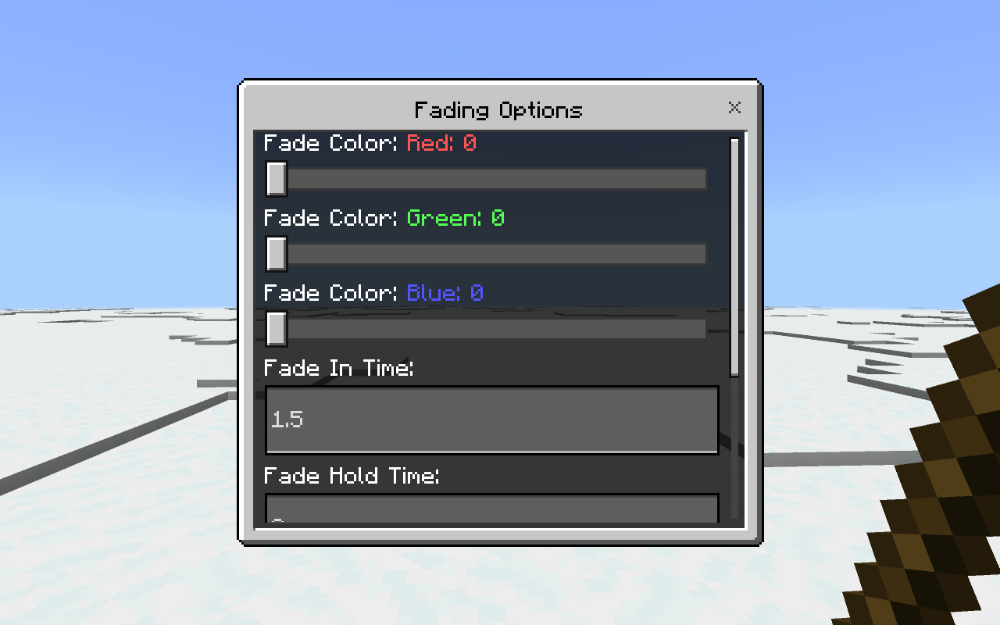
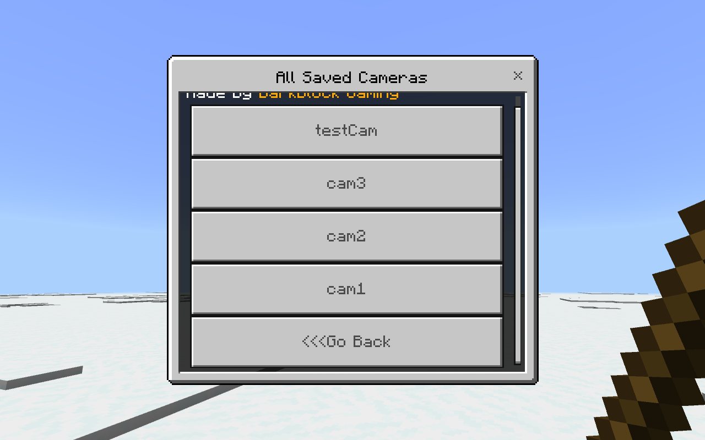

---

## 🌐 Community Discord

### Need assistance or have questions? Join our community on [Discord](https://discord.gg/CEM7cc3NQx).

---

## 💸 Donate/Sponsor

### If you enjoy this project and would like to support its development—or simply show your appreciation with a donation—we’d be truly grateful. [Donate now...](https://darkblockgaming.github.io/donate-me/)
